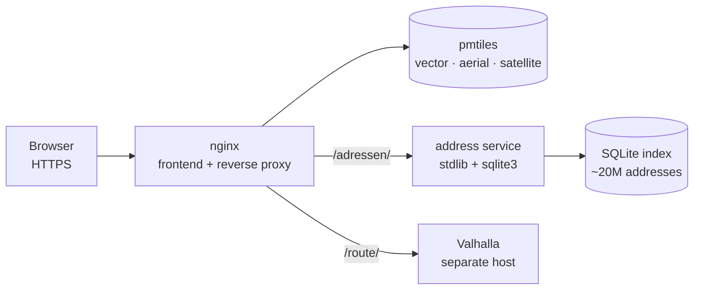

# karten

An offline map portal for a home network: vector map, aerial and satellite
layers, address search down to house numbers, and turn-by-turn routing. No tile
provider, no geocoding API, no request leaving the building.

## Why an index of my own

The usual answer for address search over OpenStreetMap data wants around 100 GB
of database and more than 16 GB of RAM. The machine this runs on has a few
gigabytes free. So instead of a general geocoder, `adressen/baue-adressindex.py`
builds an index cut to exactly one question: which town, which street, which
house number. The result is a single SQLite file of roughly a gigabyte covering
about 20 million addresses, and the build itself stays under 500 MB of memory by
working in eight resumable stages.

The service in front of it (`adressen/dienst.py`) is standard library and
`sqlite3`, nothing else. It binds no port of its own and is reachable only
through the portal's `/adressen/` path.

## What is in here

- `static/` — the frontend: MapLibre map, layer switcher, address search, route
  planning with a German turn list. Vendored third-party assets are not in this
  snapshot; `fetch-assets.sh` pulls them from their sources.
- `adressen/` — the index builder and the lookup service.
- `extract-maps.sh` — pulls a regional extract from a public pmtiles source,
  with retries and an atomic swap so a failed run never replaces a good map.
- `luftbilder/` — turning a state aerial-imagery archive into a pmtiles layer.
- `satellit/ernte-s2.py` — a polite harvester for Sentinel-2 tiles: rate
  limited, honest user agent, backs off when refused, resumable.
- `nginx.conf`, `docker-compose.yml` — the serving side.

## Two things worth knowing

Image layers belong *underneath* the first label layer of the style. Mounted on
top they cover place and street names, and you get a beautiful map nobody can
read.

Valhalla encodes route geometry with six decimal places. The widely copied
Google polyline decoder assumes five and will drop your route somewhere in the
North Sea. The frontend carries a decoder that matches.

MIT licensed.

## About this snapshot

What you see is the recipe, not the data. Tiles, imagery and the address
database are built from public sources by the scripts in here and live outside
the repository; the certificate of my in-house authority and the assistant notes
came out for this snapshot.

There is one commit because the history stays private. The portal itself has
been in daily use at home since it was built.
